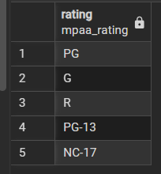

---

## SELECT DISTINCT Challenge

### Problem

Find the unique rental rates from the `film` table.

### My Approach

* I identified the column: `rental_rate`
* I noticed there were duplicate values
* I used `SELECT DISTINCT` to return only unique values

### SQL Query

```sql
SELECT DISTINCT rental_rate
FROM film;
```

### Result

* 0.99
* 2.99
* 4.99

### What I Learned

* `DISTINCT` removes duplicate values
* It helps answer questions like “what unique values exist?”
* Always think in terms of the business question first

### Screenshot



---

## SELECT WHERE Challenges

### Challenge 1

Find the email of customer Nancy Thomas.

```sql
SELECT email 
FROM customer
WHERE first_name = 'Nancy' AND last_name = 'Thomas';
```


---

### Challenge 2

Get the description of the movie "Outlaw Hanky".

```sql
SELECT title, description 
FROM film
WHERE title = 'Outlaw Hanky';
```


---

### Challenge 3

Find the phone number of the customer at '259 Ipoh Drive'.

```sql
SELECT phone 
FROM address
WHERE address = '259 Ipoh Drive';
```


