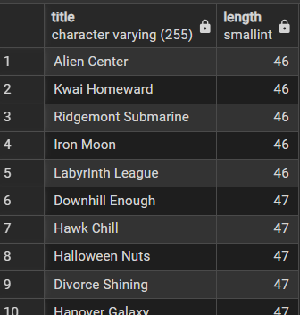

---

## ORDER BY and LIMIT Challenges

### Challenge 1: First 10 Paying Customers

#### Business Problem

We want to reward our first 10 paying customers.

#### SQL Query

```sql id="n5rqgu"
SELECT customer_id
FROM payment
ORDER BY payment_date ASC
LIMIT 10;
```

#### What I Learned

* `ORDER BY` sorts results
* `ASC` sorts from oldest to newest
* `LIMIT` controls the number of rows returned

---

### Challenge 2: Shortest Movies by Runtime

#### Business Problem

Find the 10 shortest movies a customer can watch during a short break.

#### SQL Query

```sql id="qzx67t"
SELECT title, length
FROM film
ORDER BY length ASC
LIMIT 10;
```

#### What I Learned

* `ORDER BY length ASC` sorts movies from shortest to longest
* `LIMIT 10` returns only 10 rows
* `ORDER BY` and `LIMIT` work very well together

### Screenshot


